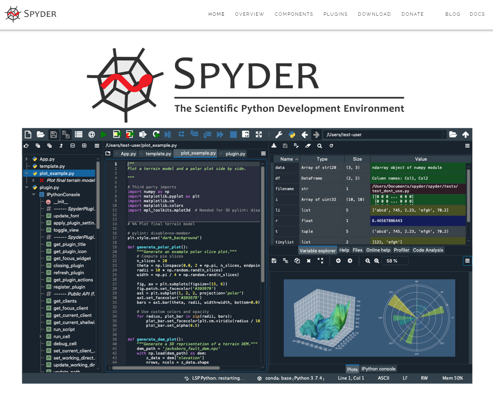

*Copyright © 2016–2020 Spyder Website Contributors*


[](./LICENSE.txt)
[](https://travis-ci.org/spyder-ide/website-spyder)
[](https://app.netlify.com/sites/spyder-website-preview/deploys)
[](#backers)
[](https://gitter.im/spyder-ide/public)





This is the repository for the Spyder IDE website at [Spyder-IDE.org](https://www.spyder-ide.org/), built with the [Lektor](https://www.getlektor.com/) static CMS and our very own [Lektor-Icon](https://spyder-ide.github.io/lektor-icon/) theme.


## Getting started


### Clone the repo with submodules

```
$ git clone --recursive https://github.com/spyder-ide/website-spyder.git
```


### Install Lektor

Using conda (Recommended way):

```
$ conda install lektor -c conda-forge
```

Running installation script:

```
$ curl -sf https://www.getlektor.com/install.sh | sh
```

Using pip:

```
$ pip install -U Lektor
```


### Run server and make changes

In the root of this repository, run a local server:

```
$ lektor server
```


## Workflow

There are 2 branches, develop and production.


### Develop

The default branch is ``develop``, which is deployed with Github Pages via Lektor to [Develop.Spyder-IDE.org](https://develop.spyder-ide.org/).


### Production

After confirming your changes look as expected, the changes from ``develop`` will be merged to ``production`` and deployed to Github Pages via Lektor to [www.Spyder-IDE.org](https://www.spyder-ide.org).


## Technologies and libraries used

This website is built using [Lektor](https://www.getlektor.com/), a static web generator that can be customized using [Jinja2](http://jinja.pocoo.org/) templates.


### Lektor plugins

The build also requires several [Lektor plugins](https://www.getlektor.com/docs/plugins/) (no extra configuration is needed; Lektor automatically installs them when building):

- [disqus-comments](https://github.com/lektor/lektor-disqus-comments)
- [atom](https://github.com/lektor/lektor-atom)


## More information

[Main Website](https://www.spyder-ide.org/)

[Download Spyder (with Anaconda)](https://www.anaconda.com/download/)

[Online Documentation](https://docs.spyder-ide.org/)

[Spyder Github](https://github.com/spyder-ide/spyder)

[Troubleshooting Guide and FAQ](https://github.com/spyder-ide/spyder/wiki/Troubleshooting-Guide-and-FAQ)

[Development Wiki](https://github.com/spyder-ide/spyder/wiki/Dev:-Index)

[Gitter Chatroom](https://gitter.im/spyder-ide/public)

[Google Group](https://groups.google.com/group/spyderlib)

[@Spyder_IDE on Twitter](https://twitter.com/spyder_ide)

[@SpyderIDE on Facebook](https://www.facebook.com/SpyderIDE/)

[Support Spyder on OpenCollective](https://opencollective.com/spyder/)
